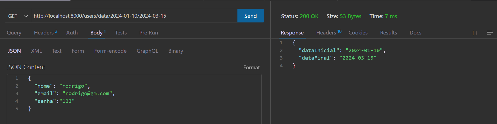
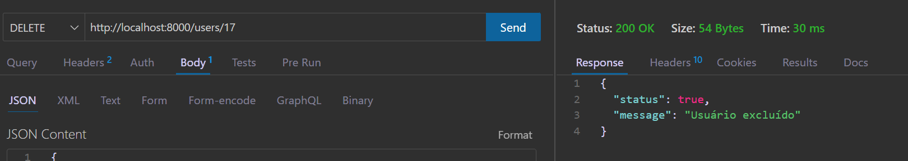
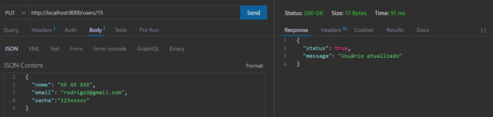
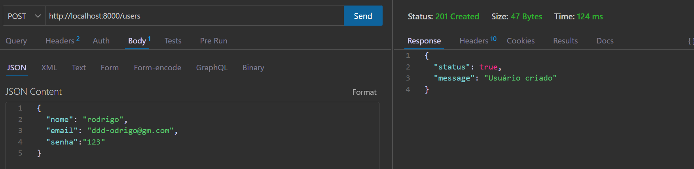
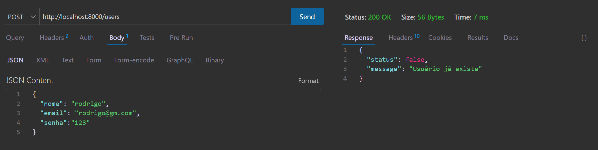
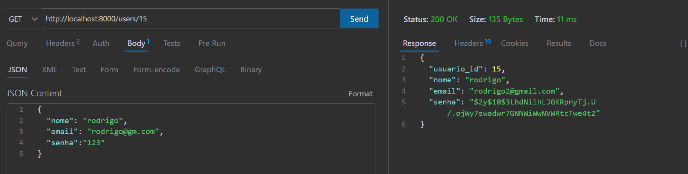
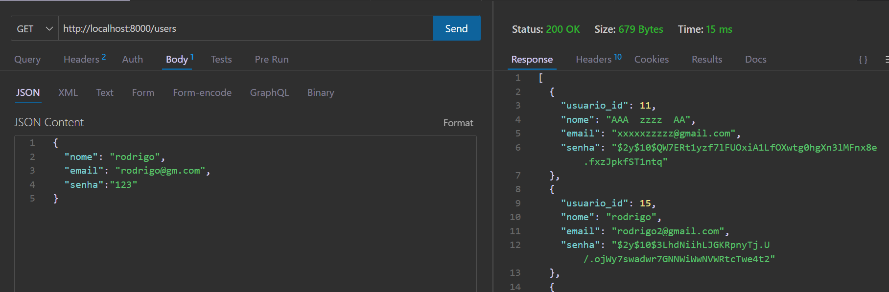

# FastRoute
O FastRoute é um projeto de backend que visa facilitar a inclusão de rotas em uma aplicação REST, permitindo a criação rápida de endpoints CRUD com operações básicas. O banco de dados utilizado é o SQLite para facilitar os testes e a configuração inicial. Este projeto não possui frontend, focando apenas no backend.

## Requisitos
- PHP 7.4+ ou superior
- Composer
- Banco de dados SQLite
- Postman ou Thunder Client (ou qualquer cliente de API REST)

## Estrutura do Projeto
A estrutura de pastas do projeto está organizada da seguinte forma:

/backend
    /Controllers
        - UserController.php (controla fluxo entre a requisição e o banco)
    /Database
        - config.php (configuração do banco)
        - Database.php (implementação de acesso ao banco)
    /Http
        - HttpHeader.php (middleware que adiciona e verifica cabeçalhos da requisição)
    /Models
        - User.php (classe model)
    /Repositories
        - UserRepository.php (classe que faz a interação dos dados com o banco)
    /Rotas
        - AttributeRouter.php (configuração autormatica do regex para capturar e tratar o atributos e traduzir)
        - Router.php 
    - agenda.db (banco SQLITE)
    - index.php (recebe as requisições e chama a AttributeRouter para gerenciar e saber qual controller usar)
/vendor
.gitignore
composer.json

## Configuração

### Clone o repositório:
git clone https://github.com/faustinopsy/FastRoute.git

Baixe as dependências do composer:
composer install

Navegue até a pasta backend:
cd backend

### Inicialize o servidor PHP:
php -S localhost:8000

## Novo Sistema de Roteamento com Atributos

Com a nova atualização, agora é possível definir rotas diretamente nos controladores usando atributos. Isso simplifica a configuração de rotas, permitindo que o mapeamento seja feito automaticamente com base nos atributos definidos acima dos métodos.

### Como Usar

Para definir uma rota, basta adicionar um atributo #[Router(...)] acima do método no controlador:
```
use Backend\Api\Rotas\Router;

class UserController {
    
    #[Router('/users', methods: ['GET'])]
    public function getAllUsers() {
        // Código para retornar todos os usuários
    }

    #[Router('/users/{id}', methods: ['GET'])]
    public function getUserById($id) {
        // Código para retornar um usuário específico pelo ID
    }

    #[Router('/users', methods: ['POST'])]
    public function createUser($data) {
        // Código para criar um novo usuário
    }

    #[Router('/login', methods: ['POST'])]
    public function login($data) {
        // Código para login
    }
    #[Router('/users/{id}', methods: ['PUT'])]
    public function updateUser($id) {
        // Código para atualizar um usuário existente
    }

    #[Router('/users/{id}', methods: ['DELETE'])]
    public function deleteUser($id) {
        // Código para deletar um usuário
    }
}
```
### Vantagens do Novo Sistema
- **Facilidade de uso**: basta definir as rotas diretamente nos métodos, sem precisar configurar manualmente cada rota.
- **Mapeamento Automático**: o sistema de roteamento detecta automaticamente os atributos e associa a rota ao método correspondente.

## Endpoints Disponíveis
- `GET /users` - Retorna todos os usuários
- `GET /users/{id}` - Retorna um usuário específico pelo ID
- `GET /users/nome/{nome}` - Retorna usuários por nome
- `GET /users/data/{dataini}/{datafim}` - Retorna as datas enviadas, mas a implementação é para relatórios
- `POST /users` - Cria um novo usuário
- `POST /login` - Login do usuario
- `PUT /users/{id}` - Atualiza um usuário existente pelo ID
- `DELETE /users/{id}` - Deleta um usuário existente pelo ID

## Exemplo de Requisição com JSON

### Exemplo para criar um novo usuário (POST /users):
Método: POST
URL: `http://localhost:8000/users`

Body (raw JSON):
{
  "nome": "seunomex",
  "email": "seunomex@gmail.com",
  "senha": "1234"
}

### Exemplo de Atualização de Usuário
Método: PUT
URL: `http://localhost:8000/users/1`

Body (raw JSON):
{
  "nome": "nomeatualizado",
  "email": "emailatualizado@gmail.com",
  "senha": "nova_senha"
}

### Exemplo de Deleção de Usuário
Método: DELETE
URL: `http://localhost:8000/users/1`
"""








